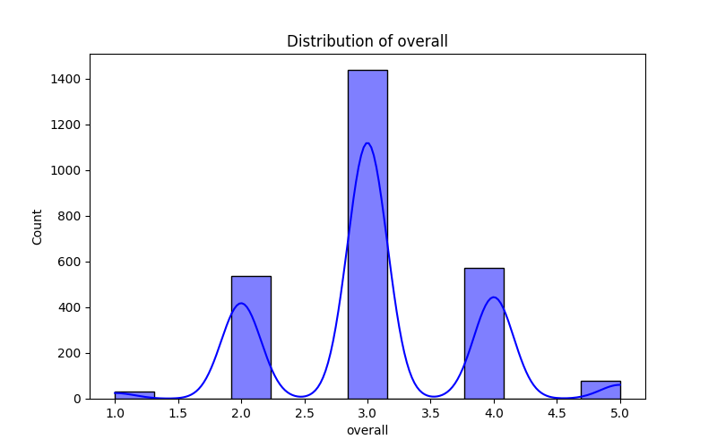

# Dataset Analysis Report: media.md

## Dataset Summary

**Shape:** (2652, 8)

**Columns:**

date, language, type, title, by, overall, quality, repeatability

## Insights and Analysis

### Key Statistics

Total rows: 2652, Total columns: 8

### Descriptive Statistics:
             date language   type              title                 by      overall      quality  repeatability
count        2553     2652   2652               2652               2390  2652.000000  2652.000000    2652.000000
unique       2055       11      8               2312               1528          NaN          NaN            NaN
top     21-May-06  English  movie  Kanda Naal Mudhal  Kiefer Sutherland          NaN          NaN            NaN
freq            8     1306   2211                  9                 48          NaN          NaN            NaN
mean          NaN      NaN    NaN                NaN                NaN     3.047511     3.209276       1.494721
std           NaN      NaN    NaN                NaN                NaN     0.762180     0.796743       0.598289
min           NaN      NaN    NaN                NaN                NaN     1.000000     1.000000       1.000000
25%           NaN      NaN    NaN                NaN                NaN     3.000000     3.000000       1.000000
50%           NaN      NaN    NaN                NaN                NaN     3.000000     3.000000       1.000000
75%           NaN      NaN    NaN                NaN                NaN     3.000000     4.000000       2.000000
max           NaN      NaN    NaN                NaN                NaN     5.000000     5.000000       3.000000

### Correlation Analysis:
                overall   quality  repeatability
overall        1.000000  0.825935       0.512600
quality        0.825935  1.000000       0.312127
repeatability  0.512600  0.312127       1.000000

### Missing Values:
date     99
by      262

## Description of Analysis

Here's a detailed description of the analysis of the dataset in simple terms:

### Overview of the Dataset
- The dataset contains a total of **2,652 entries (or rows)**, with **8 different categories (or columns)** of information.
  
### Key Statistics
1. **Count of Entries:** Out of the 2,652 entries, 2,553 have valid dates, while the rest are missing this information. 
2. **Unique Values:** 
   - There are **2,055 different dates**, indicating that the dataset spans a variety of days.
   - The **"language"** column has **11 different languages**, and the **"type"** column is made up of **8 different categories** of content (like movies, shows, etc.).
   - There are **2,312 unique titles**, showing a wide range of content.
   - The **"by"** column has **1,528 unique contributors**.

3. **Most Common Values:**
   - The most frequently occurring date is **21-May-06**.
   - The predominant language in the dataset is **English**, appearing in **1,306 entries**.
   - The most common type of entry is **movie**, which is found in **2,211 entries**.
   - The title that appears most often is **Kanda Naal Mudhal**, occurring **9 times**.
   - The contributor with the highest frequency is **Kiefer Sutherland**, who is mentioned **48 times**.

### Descriptive Statistics of Ratings
- The dataset includes ratings for the attributes **overall**, **quality**, and **repeatability**.
  - The **overall rating** (average) is about **3.05** on a scale of 1 to 5.
  - The **quality rating** average is around **3.21**.
  - The **repeatability rating** averages **1.49**.
  
- The standard deviation values indicate how much the ratings vary:
  - A lower standard deviation in quality (around **0.80**) suggests most ratings are quite close to each other, while for repeatability, the variation is lower overall with a standard deviation of about **0.60**.

### Minimum and Maximum Ratings
- The ratings range between **1 (lowest)** and **5 (highest)**.
- The **25th percentile** and **50th percentile (median)** ratings for both overall and quality are around **3**, while **for repeatability,** many ratings are also clustered at **1** and only a few as high as **3**.

### Correlation Analysis
- Correlation values show how related the ratings are to each other:
  - The **"overall" rating** is strongly correlated with the **"quality" rating** (0.83), meaning higher quality often suggests a higher overall rating.
  - There's a moderate correlation (0.51) between **overall** and **repeatability**, indicating some relationship.
  - The correlation between **quality** and **repeatability** is weaker (0.31), suggesting they are somewhat independent of one another.

### Missing Values
- The analysis shows that there are **99 missing dates** and **262 missing entries for the contributor ("by") column**. This might affect how the data can be fully interpreted.

### Summary
In summary, this dataset presents a rich variety of content in different languages with various types and many unique contributors. The statistical analysis indicates that most quality and overall ratings are fair but there are noticeable gaps with missing dates and contributors. The correlations suggest that the quality of the entries strongly impacts the overall enjoyment or assessment of the content.

## Visualizations and Descriptions

### overall Distribution

The graph above shows the distribution of the 'overall' column. It visualizes the frequency distribution of the values. Look for the central tendency, spread, and any possible skewness in the distribution. From the descriptive statistics, the mean of this column is 3.05, and the standard deviation is 0.76.

### quality Distribution

The graph above shows the distribution of the 'quality' column. It visualizes the frequency distribution of the values. Look for the central tendency, spread, and any possible skewness in the distribution. From the descriptive statistics, the mean of this column is 3.21, and the standard deviation is 0.80.

### repeatability Distribution

The graph above shows the distribution of the 'repeatability' column. It visualizes the frequency distribution of the values. Look for the central tendency, spread, and any possible skewness in the distribution. From the descriptive statistics, the mean of this column is 1.49, and the standard deviation is 0.60.

